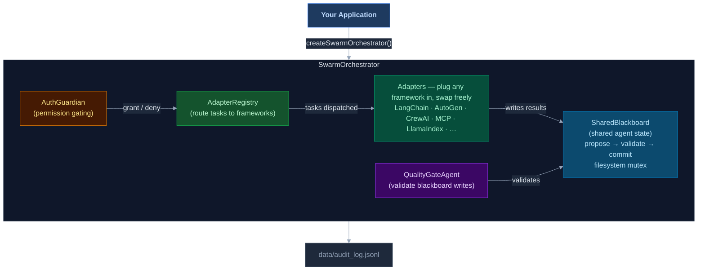

# Network-AI

**TypeScript/Node.js multi-agent orchestrator — shared state, guardrails, budgets, and cross-framework coordination**

[](https://github.com/jovanSAPFIONEER/Network-AI/actions/workflows/ci.yml)
[](https://github.com/jovanSAPFIONEER/Network-AI/actions/workflows/codeql.yml)
[](https://github.com/jovanSAPFIONEER/Network-AI/releases)
[](https://www.npmjs.com/package/network-ai)
[](#testing)
[](#adapter-system)
[](LICENSE)
[](https://socket.dev/npm/package/network-ai/overview)
[](https://nodejs.org)
[](https://typescriptlang.org)
[](https://clawhub.ai/skills/network-ai)
[](INTEGRATION_GUIDE.md)
[](https://glama.ai/mcp/servers/@jovanSAPFIONEER/network-ai)

Network-AI is a TypeScript/Node.js multi-agent orchestrator that adds coordination, guardrails, and governance to any AI agent stack.

- **Shared blackboard with locking** — atomic `propose → validate → commit` prevents race conditions and split-brain failures across parallel agents
- **Guardrails and budgets** — FSM governance, per-agent token ceilings, HMAC audit trails, and permission gating
- **14 adapters** — LangChain (+ streaming), AutoGen, CrewAI, OpenAI Assistants, LlamaIndex, Semantic Kernel, Haystack, DSPy, Agno, MCP, Custom (+ streaming), OpenClaw, A2A, and Codex — no glue code, no lock-in

> **The silent failure mode in multi-agent systems:** parallel agents writing to the same key
> use last-write-wins by default — one agent's result silently overwrites another's mid-flight.
> The outcome is split-brain state: double-spends, contradictory decisions, corrupted context,
> no error thrown. Network-AI's `propose → validate → commit` mutex prevents this at the
> coordination layer, before any write reaches shared state.

**Use Network-AI as:**
- A **TypeScript/Node.js library** — `import { createSwarmOrchestrator } from 'network-ai'`
- An **MCP server** — `npx network-ai-server --port 3001`
- A **CLI** — `network-ai bb get status` / `network-ai audit tail`
- An **OpenClaw skill** — `clawhub install network-ai`

[**5-minute quickstart →**](QUICKSTART.md) &nbsp;|&nbsp; [**Architecture →**](ARCHITECTURE.md) &nbsp;|&nbsp; [**All adapters →**](#adapter-system) &nbsp;|&nbsp; [**Benchmarks →**](BENCHMARKS.md)

> **Try the control-plane stress test — no API key, ~3 seconds:**
> ```bash
> npx ts-node examples/08-control-plane-stress-demo.ts
> ```
> Runs priority preemption, AuthGuardian permission gating, FSM governance, and compliance
> monitoring against a live swarm. No external services required.
>
> If it saves you from a race condition, a ⭐ helps others find it.

---

## Why teams use Network-AI

| Problem | How Network-AI solves it |
|---|---|
| Race conditions in parallel agents | Atomic blackboard: `propose → validate → commit` with file-system mutex |
| Agent overspend / runaway costs | `FederatedBudget` — hard per-agent token ceilings with live spend tracking |
| No visibility into what agents did | HMAC-signed audit log on every write, permission grant, and FSM transition |
| Locked into one AI framework | 14 adapters — mix LangChain + AutoGen + CrewAI + Codex + custom in one swarm |
| Agents escalating beyond their scope | `AuthGuardian` — scoped permission tokens required before sensitive operations |

---

## Architecture



> `FederatedBudget` is a standalone export — instantiate it separately and optionally wire it to a blackboard backend for cross-node token budget enforcement.

→ [Full architecture, FSM journey, and handoff protocol](ARCHITECTURE.md)

---

## Install

```bash
npm install network-ai
```

No native dependencies, no build step. Adapters are dependency-free (BYOC — bring your own client).

---

## Use as MCP Server

Start the server (no config required, zero dependencies):

```bash
npx network-ai-server --port 3001
# or from source:
npx ts-node bin/mcp-server.ts --port 3001
```

Then wire any MCP-compatible client to it.

**Claude Desktop** — add to `~/Library/Application Support/Claude/claude_desktop_config.json` (macOS) or `%APPDATA%\Claude\claude_desktop_config.json` (Windows):

```json
{
  "mcpServers": {
    "network-ai": {
      "url": "http://localhost:3001/sse"
    }
  }
}
```

**Cursor / Cline / any SSE-based MCP client** — point to the same URL:

```json
{
  "mcpServers": {
    "network-ai": {
      "url": "http://localhost:3001/sse"
    }
  }
}
```

Verify it's running:

```bash
curl http://localhost:3001/health   # { "status": "ok", "tools": <n>, "uptime": <ms> }
curl http://localhost:3001/tools    # full tool list
```

**Tools exposed over MCP:**
- `blackboard_read` / `blackboard_write` / `blackboard_list` / `blackboard_delete` / `blackboard_exists`
- `budget_status` / `budget_spend` / `budget_reset` — federated token tracking
- `token_create` / `token_validate` / `token_revoke` — HMAC-signed permission tokens
- `audit_query` — query the append-only audit log
- `config_get` / `config_set` — live orchestrator configuration
- `agent_list` / `agent_spawn` / `agent_stop` — agent lifecycle
- `fsm_transition` — write FSM state transitions to the blackboard

Each tool takes an `agent_id` parameter — all writes are identity-verified and namespace-scoped, exactly as they are in the TypeScript API.

Options: `--no-budget`, `--no-token`, `--no-control`, `--ceiling <n>`, `--board <name>`, `--audit-log <path>`.

---

## CLI

Control Network-AI directly from the terminal — no server required. The CLI imports the same core engine used by the MCP server.

```bash
# One-off commands (no server needed)
npx ts-node bin/cli.ts bb set status running --agent cli
npx ts-node bin/cli.ts bb get status
npx ts-node bin/cli.ts bb snapshot

# After npm install -g network-ai:
network-ai bb list
network-ai audit tail          # live-stream the audit log
network-ai auth token my-bot --resource blackboard
```

| Command group | What it controls |
|---|---|
| `network-ai bb` | Blackboard — get, set, delete, list, snapshot, propose, commit, abort |
| `network-ai auth` | AuthGuardian — issue tokens, revoke, check permissions |
| `network-ai budget` | FederatedBudget — spend status, set ceiling |
| `network-ai audit` | Audit log — print, live-tail, clear |

Global flags on every command: `--data <path>` (data directory, default `./data`) · `--json` (machine-readable output)

→ Full reference in [QUICKSTART.md § CLI](QUICKSTART.md)

---

## Two agents, one shared state — without race conditions

The real differentiator is coordination. Here is what no single-framework solution handles: two agents writing to the same resource concurrently, atomically, without corrupting each other.

```typescript
import { LockedBlackboard, CustomAdapter, createSwarmOrchestrator } from 'network-ai';

const board   = new LockedBlackboard('.');
const adapter = new CustomAdapter();

// Agent 1: writes its analysis result atomically
adapter.registerHandler('analyst', async () => {
  const id = board.propose('report:status', { phase: 'analysis', complete: true }, 'analyst');
  board.validate(id, 'analyst');
  board.commit(id);                           // file-system mutex — no race condition possible
  return { result: 'analysis written' };
});

// Agent 2: runs concurrently, writes to its own key safely
adapter.registerHandler('reviewer', async () => {
  const id = board.propose('report:review', { approved: true }, 'reviewer');
  board.validate(id, 'reviewer');
  board.commit(id);
  const analysis = board.read('report:status');
  return { result: `reviewed phase=${analysis?.phase}` };
});

createSwarmOrchestrator({ adapters: [{ adapter }] });

// Both fire concurrently — mutex guarantees no write is ever lost
const [, ] = await Promise.all([
  adapter.executeAgent('analyst',  { action: 'run', params: {} }, { agentId: 'analyst' }),
  adapter.executeAgent('reviewer', { action: 'run', params: {} }, { agentId: 'reviewer' }),
]);

console.log(board.read('report:status'));   // { phase: 'analysis', complete: true }
console.log(board.read('report:review'));   // { approved: true }
```

Add budgets, permissions, and cross-framework agents with the same pattern. → [QUICKSTART.md](QUICKSTART.md)

---

## Demo — Control-Plane Stress Test *(no API key)*

Runs in ~3 seconds. Proves the coordination primitives without any LLM calls.

```bash
npm run demo -- --08
```

What it shows: atomic blackboard locking, priority preemption (priority-3 wins over priority-0 on same key), **AuthGuardian permission gate** (blocked → justified → granted with token), FSM hard-stop at 700 ms, live compliance violation capture (TOOL_ABUSE, TURN_TAKING, RESPONSE_TIMEOUT, JOURNEY_TIMEOUT), and `FederatedBudget` tracking — all without a single API call.

[](https://www.youtube.com/watch?v=niVRZJu1MEo)

**8-agent AI pipeline** (requires `OPENAI_API_KEY` — builds a Payment Processing Service end-to-end):

```bash
npm run demo -- --07
```

[](https://youtu.be/UyMsNhaw9lU)

---

## Adapter System

14 adapters, zero adapter dependencies. You bring your own SDK objects.

| Adapter | Framework / Protocol | Register method |
|---|---|---|
| `CustomAdapter` | Any function or HTTP endpoint | `registerHandler(name, fn)` |
| `LangChainAdapter` | LangChain | `registerAgent(name, runnable)` |
| `AutoGenAdapter` | AutoGen / AG2 | `registerAgent(name, agent)` |
| `CrewAIAdapter` | CrewAI | `registerAgent` or `registerCrew` |
| `MCPAdapter` | Model Context Protocol | `registerTool(name, handler)` |
| `LlamaIndexAdapter` | LlamaIndex | `registerQueryEngine()`, `registerChatEngine()` |
| `SemanticKernelAdapter` | Microsoft Semantic Kernel | `registerKernel()`, `registerFunction()` |
| `OpenAIAssistantsAdapter` | OpenAI Assistants | `registerAssistant(name, config)` |
| `HaystackAdapter` | deepset Haystack | `registerPipeline()`, `registerAgent()` |
| `DSPyAdapter` | Stanford DSPy | `registerModule()`, `registerProgram()` |
| `AgnoAdapter` | Agno (formerly Phidata) | `registerAgent()`, `registerTeam()` |
| `OpenClawAdapter` | OpenClaw | `registerSkill(name, skillRef)` |
| `A2AAdapter` | Google A2A Protocol | `registerRemoteAgent(name, url)` |
| `CodexAdapter` | OpenAI Codex / gpt-4o / Codex CLI | `registerCodexAgent(name, config)` |

**Streaming variants** (drop-in replacements with `.stream()` support):

| Adapter | Extends | Streaming source |
|---|---|---|
| `LangChainStreamingAdapter` | `LangChainAdapter` | Calls `.stream()` on the Runnable if available; falls back to `.invoke()` |
| `CustomStreamingAdapter` | `CustomAdapter` | Pipes `AsyncIterable<string>` handlers; falls back to single-chunk for plain Promises |

Extend `BaseAdapter` (or `StreamingBaseAdapter` for streaming) to add your own in minutes. See [references/adapter-system.md](references/adapter-system.md).

---

## Works with LangGraph, CrewAI, and AutoGen

> Network-AI is the coordination layer you add **on top of** your existing stack. Keep your LangChain chains, CrewAI crews, and AutoGen agents — and add shared state, governance, and budgets around them.

| Capability | Network-AI | LangGraph | CrewAI | AutoGen |
|---|---|---|---|---|
| Cross-framework agents in one swarm | ✅ 14 built-in adapters | ⚠️ Nodes can call any code; no adapter abstraction | ⚠️ Extensible via tools; CrewAI-native agents only | ⚠️ Extensible via plugins; AutoGen-native agents only |
| Atomic shared state (conflict-safe) | ✅ `propose → validate → commit` mutex | ⚠️ State passed between nodes; last-write-wins | ⚠️ Shared memory available; no conflict resolution | ⚠️ Shared context available; no conflict resolution |
| Hard token ceiling per agent | ✅ `FederatedBudget` (first-class API) | ⚠️ Via callbacks / custom middleware | ⚠️ Via callbacks / custom middleware | ⚠️ Built-in token tracking in v0.4+; no swarm-level ceiling |
| Permission gating before sensitive ops | ✅ `AuthGuardian` (built-in) | ⚠️ Possible via custom node logic | ⚠️ Possible via custom tools | ⚠️ Possible via custom middleware |
| Append-only audit log | ✅ plain JSONL (`data/audit_log.jsonl`) | ⚠️ Not built-in | ⚠️ Not built-in | ⚠️ Not built-in |
| Encryption at rest | ✅ AES-256-GCM (TypeScript layer) | ⚠️ Not built-in | ⚠️ Not built-in | ⚠️ Not built-in |
| Language | TypeScript / Node.js | Python | Python | Python |

---

## Testing

```bash
npm run test:all          # All suites in sequence
npm test                  # Core orchestrator
npm run test:security     # Security module
npm run test:adapters     # All 14 adapters
npm run test:streaming    # Streaming adapters
npm run test:a2a          # A2A protocol adapter
npm run test:codex        # Codex adapter
npm run test:priority     # Priority & preemption
npm run test:cli          # CLI layer
```

**1,399 passing assertions across 17 test suites** (`npm run test:all`):

| Suite | Assertions | Covers |
|---|---|---|
| `test-phase4.ts` | 147 | FSM governance, compliance monitor, adapter integration |
| `test-phase5f.ts` | 127 | SSE transport, `McpCombinedBridge`, extended MCP tools |
| `test-phase5g.ts` | 121 | CRDT backend, vector clocks, bidirectional sync |
| `test-phase6.ts` | 121 | MCP server, control-plane tools, audit tools |
| `test-adapters.ts` | 140 | All 14 adapters, registry routing, integration, edge cases |
| `test-phase5d.ts` | 117 | Pluggable backend (Redis, CRDT, Memory) |
| `test-standalone.ts` | 88 | Blackboard, auth, integration, persistence, parallelisation, quality gate |
| `test-phase5e.ts` | 87 | Federated budget tracking |
| `test-phase5c.ts` | 73 | Named multi-blackboard, isolation, backend options |
| `test-codex.ts` | 51 | Codex adapter: chat, completion, CLI, BYOC client, error paths |
| `test-priority.ts` | 64 | Priority preemption, conflict resolution, backward compat |
| `test-a2a.ts` | 35 | A2A protocol: register, execute, mock fetch, error paths |
| `test-streaming.ts` | 32 | Streaming adapters, chunk shapes, fallback, collectStream |
| `test-phase5b.ts` | 55 | Pluggable backend part 2, consistency levels |
| `test-phase5.ts` | 42 | Named multi-blackboard base |
| `test-security.ts` | 34 | Tokens, sanitization, rate limiting, encryption, audit |
| `test-cli.ts` | 65 | CLI layer: bb, auth, budget, audit commands |

---

## Documentation

| Doc | Contents |
|---|---|
| [QUICKSTART.md](QUICKSTART.md) | Installation, first run, CLI reference, PowerShell guide, Python scripts CLI |
| [ARCHITECTURE.md](ARCHITECTURE.md) | Race condition problem, FSM design, handoff protocol, project structure |
| [BENCHMARKS.md](BENCHMARKS.md) | Provider performance, rate limits, local GPU, `max_completion_tokens` guide |
| [SECURITY.md](SECURITY.md) | Security module, permission system, trust levels, audit trail |
| [ENTERPRISE.md](ENTERPRISE.md) | Evaluation checklist, stability policy, security summary, integration entry points |
| [AUDIT_LOG_SCHEMA.md](AUDIT_LOG_SCHEMA.md) | Audit log field reference, all event types, scoring formula |
| [ADOPTERS.md](ADOPTERS.md) | Known adopters — open a PR to add yourself |
| [INTEGRATION_GUIDE.md](INTEGRATION_GUIDE.md) | End-to-end integration walkthrough |
| [references/adapter-system.md](references/adapter-system.md) | Adapter architecture, writing custom adapters |
| [references/auth-guardian.md](references/auth-guardian.md) | Permission scoring, resource types |
| [references/trust-levels.md](references/trust-levels.md) | Trust level configuration |

---

## Contributing

1. Fork → feature branch → `npm run test:all` → pull request
2. Bugs and feature requests via [Issues](https://github.com/jovanSAPFIONEER/Network-AI/issues)

---

MIT License — [LICENSE](LICENSE) &nbsp;·&nbsp; [CHANGELOG](CHANGELOG.md) &nbsp;·&nbsp; [CONTRIBUTING](CONTRIBUTING.md) &nbsp;·&nbsp; [](https://github.com/jovanSAPFIONEER/Network-AI/releases.atom)

<details>
<summary>Keywords</summary>

multi-agent · agent orchestration · AI agents · agentic AI · agentic workflow · TypeScript · Node.js · LangGraph · CrewAI · AutoGen · MCP · model-context-protocol · LlamaIndex · Semantic Kernel · OpenAI Assistants · Haystack · DSPy · Agno · OpenClaw · ClawHub · shared state · blackboard pattern · atomic commits · guardrails · token budgets · permission gating · audit trail · agent coordination · agent handoffs · governance · cost-awareness

</details>
